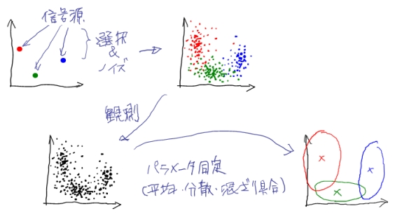

# EMアルゴリズム

## 概要

たとえば、複数の信号源があって、そこから毎回確率的にどれかの信号源が選ばれて発生されるデータを観測することを考えます。
ただし観測されたデータは、どの信号源から発生されたかはわからないとします。
また、データにはノイズがのっているなど、各々の信号源も確率的な挙動を示すことにしましょう。

このとき、観測できるデータだけから、確率モデルでモデル化した信号源（と信号源の混ざり具合）のパラメータ同定を行う手法として、以下で説明するEMアルゴリズムを利用することが出来ます。

## 定義

観測データを $$X$$ 、観測できないデータは特に隠れ変数と言い、$$Y$$ とします。
どちらも確率変数です。
$$Y$$ は上の例で言えば信号源のインデックス（どの信号源が選ばれたか）になります。
観測データと隠れ変数を合わせた $$Z=(X,Y)$$ を完全データと言い、システムの全ての確率変数となります。

また便宜上、観測データの定義範囲を $$\Omega_X$$、隠れ変数の定義範囲を $$\Omega_Y$$とします（ $$X\in\Omega_X,Y\in\Omega_Y$$ ）。

完全データは、パラメータ $$\theta$$ をもつ確率分布によってモデル化しておきます。
すなわち確率密度関数 $$p(X,Y|\theta)$$ が分かっているとします。
ここで $$X,Y$$ ともに連続的な確率変数として以降も扱いますが、（先の例の $$Y$$ のように）離散的な場合でも適宜読み替え（ $$\int$$ → $$\sum$$ など）を行うだけでOKです。

EM（Expextation Maximization）は、概要の例に限らず一般化すると、ある種の確率密度関数 $$p(X,Y|\theta)$$ に対して観測データ $$X$$ だけが与えられたときに、 $$\theta$$ を効率よく推定することができるアルゴリズムです。
「ある種の」と言いましたが、これは指数型分布族（ガウシアンとか）を指します。

## 最尤推定

さて、最終的な目標は、観測データ $$X$$ を最もよく説明できるパラメータ $$\theta$$ を求めることなわけですから、
$$p(X|\theta)$$ を $$\theta$$ のもっともらしさとして考え、これを最大化すればよいことになります（最尤推定）。
つまり $$\max_\theta \ p(X|\theta)$$ 、
あるいは対数尤度の最大化 $$ \max_\theta \ \ln p(X|\theta) $$
になります。
すると一見あとは
$$ {\partial\over\partial\theta} p(X|\theta)=0 $$ または
$$ {\partial\over\partial\theta} \ln p(X|\theta)=0 $$
とすれば（少なくとも極大値は）解析的に求まりそうな気がします。
しかし今は隠れ変数 $$Y$$ があるので、尤度は $$p(X,Y|\theta)$$ を $$Y$$で積分して周辺化したものになります。

$$
p(X|\theta)=\int_{\Omega_Y}p(X,Y|\theta)dY
$$

こうなると、極値条件から $$\theta$$ を $$X$$ だけで書き下すのは難しくなるっぽいので、
反復的に $$\theta_0,\theta_1,\ldots,\theta_t,\ldots$$ と徐々に
解に近づけていくことを考えたくなります。

EMアルゴリズムはこの反復計算法を与えます。
しかも！一回の反復につき、尤度が必ず上昇すること（$$p(X|\theta_{t+1}) \ge p(X|\theta_t)$$）が保障されているのです。

## 対数尤度の分解表現

かなり天下り的ですが対数尤度を変形していきます。

まずベイズの定理により

$$ \ln p(X|\theta) = \ln p(X,Y|\theta) - \ln p(Y|X,\theta) $$

です。
次に、確率変数 $$Y$$ について任意の確率密度関数を $$q(Y)$$ とします。
確率分布なので

$$\int_{\Omega_Y} q(Y)dY=1$$

なのと、
$$\ln p(X|\theta)$$ は $$Y$$ に関係ないことから、

$$
\ln p(X|\theta) = \ln p(X|\theta) \int_{\Omega_Y} q(Y) dY
                = \int_{\Omega_Y} q(Y) \ln p(X|\theta) dY
$$

とできます。
一方で

$$
\ln p(X|\theta)
= \ln p(X,Y|\theta) - \ln q(Y)  + \ln q(Y) - \ln p(Y|X,\theta)
= \ln{p(X,Y|\theta) \over q(Y)} + \ln{q(Y) \over p(Y|X,\theta)}
$$

なので、合わせて

$$
\ln p(X|\theta)
 = \int_{\Omega_Y} q(Y) \ln{p(X,Y|\theta) \over q(Y)} dY +
   \int_{\Omega_Y} q(Y) \ln{q(Y) \over p(Y|X,\theta)} dY
$$

と導くことができます。
第2項は $$q(Y)$$ から $$p(Y|X,\theta)$$ の（確率変数 $$Y$$ についての）カルバック・ライブラー情報量として知られているものになっています。
これを $$KL(q \parallel p_{|X,\theta})$$ と書くことにします。

## EMアルゴリズム

これでやっとEMアルゴリズムを説明できるところまで来ました。

EMはEステップとMステップという2段階から成っています。
ステップと言ってますが、これはあくまで数学的な導出のステップであって、
計算機で実現する意味でのステップとは違います。

ではパラメータを $$\theta^t$$ から $$\theta^{t+1}$$ に更新することを考えます。
以下、

* $$X, \theta^t, \theta^{t+1}$$ は、実際にはデータとしての値が入るもの
* $$Y, \theta$$ は、数学的な意味での変数

であることを念頭に置くと理解しやすいかもしれません。

### Expectation Step

先の対数尤度の分解表現において、$$q(Y)$$ は正規化されていればなんでもよかったので、$$q(Y) = p(Y|X,\theta^t)$$ とします。

$$
\ln p(X|\theta)
 = \int_{\Omega_Y} p(Y|X,\theta^t) \ln{p(X,Y|\theta) \over p(Y|X,\theta^t)} dY +
   KL(p_{|X,\theta^t} \parallel p_{|X,\theta})
$$

第1項を $$L(\theta, \theta^t)$$ と置きます。
また、

$$
L(\theta, \theta^t)
 = \int_{\Omega_Y} p(Y|X,\theta^t) \ln p(X,Y|\theta) dY -
   \int_{\Omega_Y} p(Y|X,\theta^t) \ln p(Y|X,\theta^t) dY
$$

で、第1項を

$$
Q(\theta, \theta^t) = \int_{\Omega_Y} p(Y|X,\theta^t) \ln p(X,Y|\theta) dY
$$

と置きます。

Eステップはこの $$Q(\theta, \theta^t)$$ の導出ということになります。
$$Q(\theta, \theta^t)$$ は、完全データの対数尤度 $$\ln p(X,Y|\theta)$$ を確率分布 $$p(Y|X,\theta^t)$$ で期待値計算したものといえます。

### Maximization Step

Mステップではその名の通り、

$$
L(\theta, \theta^t)
 = Q(\theta, \theta^t) -
   \int_{\Omega_Y} p(Y|X,\theta^t) \ln p(Y|X,\theta^t) dY
$$

を $$\theta$$ について最大化して、そのときの $$\theta$$ を $$\theta_{t+1}$$ とします。
ここで $$ L(\theta, \theta^t)=\cdots $$ の第2項は $$\theta$$ に関係ないので、結局

$$
\theta^{t+1} = \arg\max_\theta Q(\theta, \theta^t)
$$

と等価です。

最大化は結局（多くの場合） $${\partial\over\partial\theta}Q=0$$ とやるわけで、$$Q$$ の極値を解析的に求めるのって無理そうじゃん・・・って思われますがそうでもありません。
$$Q$$ の定義を良く見ると、$$\theta$$ に関係あるのは $$\ln p(X,Y|\theta)$$ だけです。
$$p(X,Y|\theta)$$ がガウシアンとかなら
（冒頭の $${\partial\over\partial\theta} \ln p(X|\theta)=0$$ に比べれば）
かなり簡単になりそうな予感がします。
実際のところは適用例を見てみてください。

あとはEステップ・Mステップを収束するまで繰り返せばいいわけですね。
そして $$\theta$$ が決まれば、たとえば $$p(Y|X,\theta)=p(X,Y|\theta)/p(X|\theta)$$ が計算できるので、任意の $$X$$ に対する $$Y$$ の推定ができたりします。
最初の例でいえば、新たな観測データに対する発生源の判別、つまりクラスタリングができます。
他にも回帰とかにも使えそうです。

### 対数尤度の単調増加

パラメータ $$\theta_t$$ での対数尤度は、同一の確率分布どうしのカルバック・ライブラー情報量はゼロになるので、

$$
\begin{array}{ll}
\ln p(X|\theta^t)
&= L(\theta^t, \theta^t) +
   KL(p_{|X,\theta^t} \parallel p_{|X,\theta^t}) \\
&= L(\theta^t, \theta^t)
\end{array}
$$

となります。
一方パラメータ $$\theta_{t+1}$$ での対数尤度は

$$
\ln p(X|\theta^{t+1})
 = L(\theta^{t+1}, \theta^t) +
   KL(p_{|X,\theta^t} \parallel p_{|X,\theta^{t+1}})
$$

となります。

Mステップの定義から明らかに

$$L(\theta^{t+1}, \theta^t) \ge L(\theta^t, \theta^t)$$

で、異なる確率分布間のカルバック・ライブラー情報量は正ですから、

$$
\ln p(X|\theta^{t+1}) \ge \ln p(X|\theta^t)
$$

が必ず成立します。

## 適用例

* [Gaussian Mixture Model](GMM)
* Hidden Markov Model
