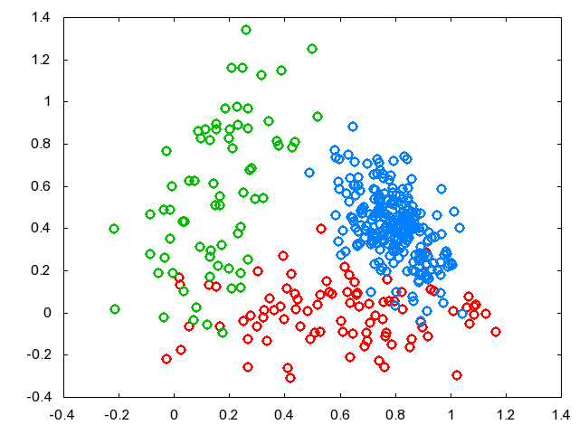
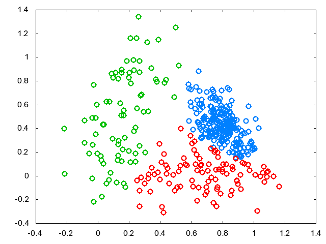
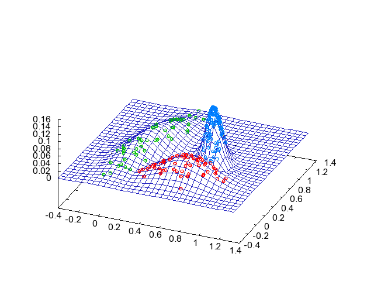
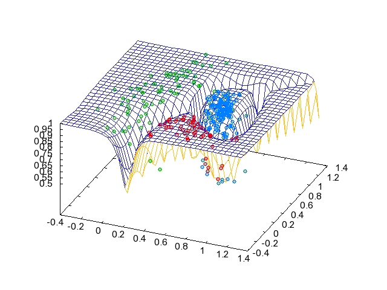

# GMMクラスタリング

## サンプルコード

[ここ](https://github.com/convexbrain/studynotes/tree/master/sandbox/EM/GaussianMixture) にあります。

ただし [GMM](GMM) のMステップの共分散行列の更新式は

$$
S_i^{t+1} = { \sum_n (x_n-\mu_i^t)(x_n-\mu_i^t)^T E(y_{ni}) \over \sum_n E(y_{ni}) }
$$

と、$$\mu_i^{t+1}$$ の代わりに $$\mu_i^t$$ を使いました。
なんとなくループの数とか依存関係とか減らしたかったので。
コードチューンしようってわけではないですが癖ですね。
結果は問題ないようです。

収束判定のための $$\ln p(X|\theta)$$ はMステップ直後ではなく、Eステップで計算してます。
$$\phi_k N(x_n|\mu_k, S_k)$$ が使いまわせて効率がいいので。
これも無意識にやってた。。。

## 結果

3クラスからなる2Dのデータ↓を与えてクラスタリングしてみました。
正解の色がついてますが、実際にはこの情報は入力されません。

学習後、$$k=\arg\max_k p(y_k=1 \mid x,\theta)$$ によりクラスタリングした結果です↓

各正規分布のパラメータがどう推定されているかを見るために、$$N(x \mid \mu_k, S_k) \ (k=\arg\max_k p(y_k=1 \mid x,\theta))$$ をグラフにしてみました↓

↓は $$\max_k p(y_k=1|x,\theta)$$ のグラフです。
クラス境界はクラスタリングに「自信がない」ことがわかります。

