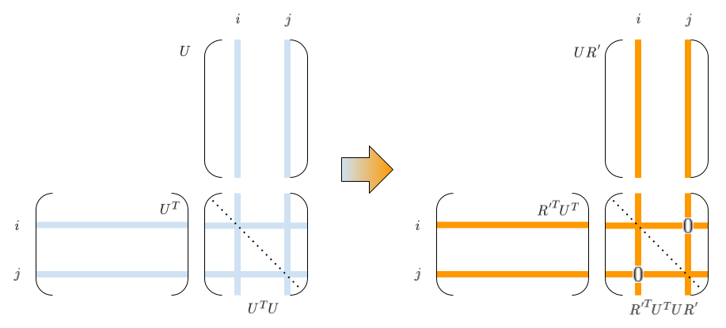

# SVD

特異値分解(Singular Value Decomposition)は、任意の $$m\times n$$ 行列 $$G$$ を
$$ G = U \Sigma V^* $$ の形に分解します。
なお以下では、実数を成分とする行列のみ扱い、$$ G = U \Sigma V^T $$ とします。

もし $$G$$ が正則行列（したがって正方行列）の場合は、
* $$\Sigma$$ ：対角成分が特異値の対角行列
* $$U,\,V$$ ：直交行列

となり、逆行列が $$G^{-1} = V \Sigma^{-1} U^T$$ のように求まります。

$$G$$ が非正則または非正方な場合でも、$$\Sigma,\,U,\,V$$ は似たような性質を持ち、
$$G^{+} = V \Sigma^{+} U^T$$ で擬似逆行列を計算することができます。
（$$\Sigma^{+}$$ は $$\Sigma^T$$ で非ゼロの特異値を逆数にしたもの）

## 擬似逆行列 for 線形連立方程式

擬似逆行列が求まるので、線形連立方程式を汎用的に解くことができます。
ふつうの線形連立方程式の場合はその解が、優決定(over-determined)な場合は最小二乗解が、
劣決定(under-determined)な場合はノルム最小解が求まります。

[主双対内点法](PrimalDualIPM) のアルゴリズムでも、
線形連立方程式の解を求める必要があります。
主双対内点法の場合は正方行列であり、
対象の最適化問題によっては必ず正則になることもあるので、
SVDだとオーバースペックかもしれません。
しかし、問題によっては求解途中に特異的になったり、
（$$A$$ などの）係数パラメータが実データから決まるせいで
ゼロがちになったりすることもありうるかと思います。
こういうときでも安定して使えるのでやはりSVDが便利です。

## One-sided Jacobi for SVD

SVDにもいろいろなアルゴリズムがあるようですが、
[LAPACK Working Notes](http://www.netlib.org/lapack/lawns/index.html) lawn15の
Algorithm 4.1にあるOne-sided Jacobi for SVDがいちばんシンプルでわかりやすそうです。
ただlawn15では簡単のため正方行列を前提にしているようです。
ここでは非正方行列も考慮します。

非正方行列の考慮にあたり、
$$U,\,\Sigma,\,V$$ の形状などはいろいろなパターンが考えられるようですが、ここでは
* $$m \ge n$$（$$m \lt n$$ の場合は$$G^T$$を分解すればよい）を前提にして、
    * $$U$$ ： $$m \times n$$
    * $$\Sigma$$ ： $$n \times n$$、特異値のならび（昇順・降順）は特に問わない
    * $$V$$ ： $$n \times n$$

とします。

### アルゴリズム

* パラメータ
    * $$\tau$$：計算機イプシロン程度の値
* 初期化
    * $$U \leftarrow G$$　
    * $$V \leftarrow I$$　
* 以下を繰り返し
    * $$1 \le i \lt j \le n$$ のすべての $$i,\,j$$ について
        * $$u_i$$ を $$U$$ の $$i$$ 列目の列ベクトルとする（$$u_j,\,v_i,\,v_j$$ も同様に定義）
        * $$a = u_i^T u_i,\,b = u_j^T u_j,\,d = u_i^T u_j$$ を算出
        * 収束条件 $$d^2 \le \tau^2 a b$$ を満たしていなかったら以下を計算
            * $$\zeta = {b - a \over 2d}$$　
            * $$t = {sign(\zeta) \over \mid\zeta\mid + \sqrt{1 + \zeta^2}}$$　
            * $$c = {1 \over \sqrt{1 + t^2}},\,s = ct,\,
                R = 
                \left[ \begin{array}{cc}
                c & s \\ -s & c
                \end{array} \right]$$　
            * $$[u_i \quad u_j] \leftarrow [u_i \quad u_j] R$$　
            * $$[v_i \quad v_j] \leftarrow [v_i \quad v_j] R$$　
    * すべての $$i,\,j$$ の収束条件が満たされていたら繰り返しを出る
* 正規化と特異値の算出
    * 特異値 $$\sigma_i = \|u_i\| \qquad(1 \le i \le n)$$
    * 特異値をベクトル $$\sigma$$ として $$\Sigma = {\bf diag}(\sigma) $$　
    * $$u_i \leftarrow {u_i \over \|u_i\|} \qquad(1 \le i \le n)$$　

#### 解釈

繰り返しの内側部分は、$$n$$ 列から2列選ぶ $${}_nC_2$$ 通り分のループになっています。
ループ中、$$U,\,V$$ （の各々2列）が逐次更新されていきますが、
この更新では $$UV^T=G$$ の関係が常に保たれます。
というのも、この更新は（$$2 \times 2$$ 回転行列 $$R$$ による演算と等価な）$$n \times n$$ 直交行列 $$R'$$ を用いて、

$$UV^T \rightarrow (UR')(VR')^T = UR'R'^TV^T = UV^T = G$$

のように書けるためです。

そして $$R'$$ すなわち $$R$$ の成分 $$c,s$$ は、
$$(UV^T)^T UV^T = VU^T UV^T$$ を考えた時の $$U^TU$$ の $$(i,j)$$ 要素
（$$U^TU$$は対象行列なので $$(j,i)$$ 要素も）をゼロにするような値に計算されています。

したがって、収束して繰り返しを出たときには、$$U^TU$$ は（$$\tau$$ で許容されるレベルで）
対角行列になっているので、$$U$$ の各列正規化で
$$U \rightarrow U {\bf diag}(\sigma)$$ のように分離して、
互いに異なる列が直交する $$U$$ と、対角行列 $$\Sigma$$ を得ることができます。
$$V$$ も、単位行列に直交行列をどんどんかけていったものなので、
直交行列になっていることがわかります。

### 実装例

[SVDマルチスレッド実装](SVDMultiThread) 参照。
