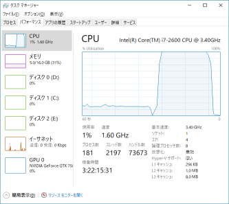
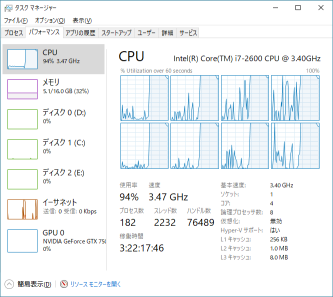
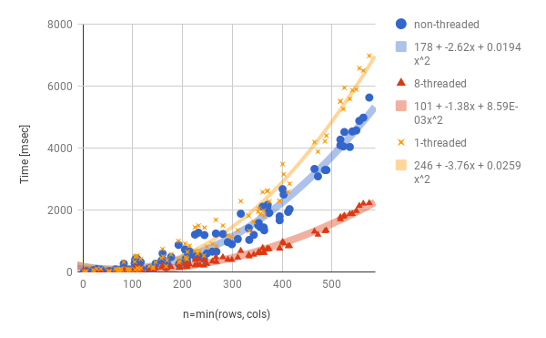

# SVDマルチスレッド実装

## 並列化

[SVD](SVD) のアルゴリズム解釈の図からもわかるように、
One-sided Jacobi for SVDの最も内側のループでの $$U,\,V$$ の更新は、
$$i,\,j$$ の2列のペアしか参照・更新しません。

したがって、列がかぶらない列ペア同士は、並列に更新できます。
そうすることで、繰り返しの内側部分は最大で $$n/2$$ 並列動作が可能です。

例えば $$m \times 4$$ 行列の場合、$${}_4C_2=6$$ ペアのうち、下図のように

* 赤：(1, 2)列ペアと(3, 4)列ペアを並列処理
* 緑：(1, 3)列ペアと(2, 4)列ペアを並列処理
* 青：(1, 4)列ペアと(2, 3)列ペアを並列処理

とすることで、理屈上は2倍速動作ができます。

[ここ](https://github.com/convexbrain/studynotes/tree/master/sandbox/MatFact/SVD) にあるコードでは、マルチスレッド化されたSVDも準備しています。

上記のコードでは、スレッド起動前に、上図のように事前に並列化する列ペア群を決めています。
一方、各スレッドが計算時間に応じて動的に列を排他して奪い合う形式も考えられます。
動的な形式のほうが、より適応的に負荷バランスが調整されるメリットがありますが、
その時その時で列ペアの更新順序が変わるために
SVD結果が多少異なってしまう可能性があるというデメリットもあります。

## 計算量

以降は Intel Core i7-2600 (8 threads) @ 3.4GHz, 16GB RAM の環境で実行したものです。

### CPU負荷率

適当なサイズ（$$1000 \times 1000$$）の行列をSVDしてCPU負荷率を確認します。

↑前半がnon-threadedで15%程度、後半が8-threadedでちゃんと100%になっています。

論理プロセッサごとのグラフだと↓

で、ちゃんと8つともフル回転していることがわかります。

### 計算時間

次に、いろんなサイズの行列をSVDして、サイズと計算時間の関係をプロットしてみました↓

まず横軸ですが、 $$n$$（行列の行数または列数の小さいほう）にしています。つまり、計算時間は行列の要素数 $$m \times n$$ ではなく $$n$$ に相関があるようです。
また、二次関数でよく近似できており、計算量は $$O(n^2)$$ のようです。

non-threadedと8-threadedを比較すると、2倍速強程度にしかなっていないですね。
考えられる原因としては
1. 収束までの繰り返し回数が増えている
   （列がかぶらないように並列化する列ペア群を決めており $$i,j$$ の走査順が異なるため）
2. スレッド化で必要な処理のオーバーヘッド
3. スレッド同期コストが高い
4. 実並列度が低い

などでしょうか。

1.は、↓のグラフでわかるように、それほど影響ないようです。

なお、8-threadedと1-threaded（スレッド並列化ありのコードだが、起動スレッド数が1）では同じ走査順、したがって同じ繰り返し数になっています。

2., 3.は、1-threadedが遅いのを見るに、それなりにありそうです。

4.も、列ペアの余りが発生するなどにより割と起きてそうです。これについては、繰り返し間をパイプライン的に実行するなど、改善の余地があるかもしれません。
