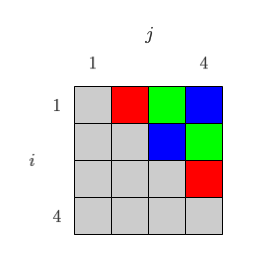

# SVDマルチスレッド実装

## 並列化

[SVD](SVD) のアルゴリズム解釈の図からもわかるように、
One-sided Jacobi for SVDの最も内側のループでの $$U,\,V$$ の更新は、
$$i,\,j$$ の2列のペアしか参照・更新しません。

したがって、列がかぶらない列ペア同士は、並列に更新できます。
そうすることで、繰り返しの内側部分は最大で $$n/2$$ 並列動作が可能です。

例えば $$m \times 4$$ 行列の場合、$${}_4C_2=6$$ ペアのうち、下図のように

* 赤：(1, 2)列ペアと(3, 4)列ペアを並列処理
* 緑：(1, 3)列ペアと(2, 4)列ペアを並列処理
* 青：(1, 4)列ペアと(2, 3)列ペアを並列処理

とすることで、理屈上は2倍速動作ができます。

[ここ](https://github.com/convexbrain/studynotes/tree/master/sandbox/MatFact/SVD) にあるコードでは、マルチスレッド化されたSVDも準備しています。

上記のコードでは、スレッド起動前に、上図のように事前に並列化する列ペア群を決めています。
一方、各スレッドが計算時間に応じて動的に列を排他して奪い合う形式も考えられます。
動的な形式のほうが、より適応的に負荷バランスが調整されるメリットがありますが、
その時その時で列ペアの更新順序が変わるために
SVD結果が多少異なってしまう可能性があるというデメリットもあります。

## 実行例

### カーブフィッティング

__（あとで書く）__

### 並列化と計算量

__（あとで書く）__
