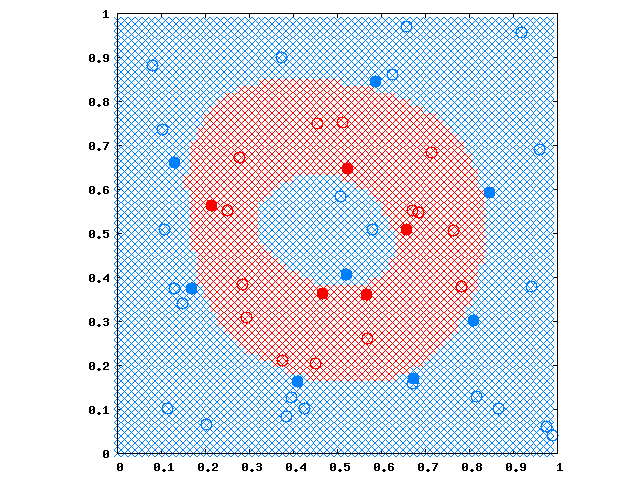
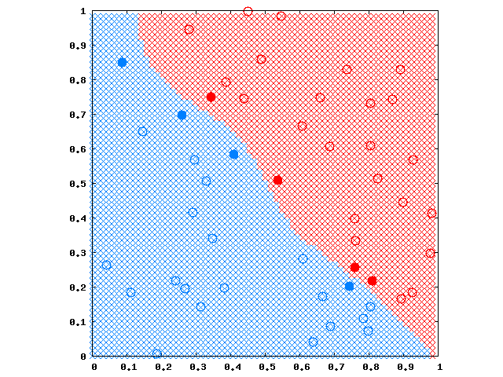

# SMOアルゴリズム

## 問題再掲

[ハードマージンSVM](SVM) の学習問題は
$$
\text{ find } \alpha \text{ s.t. }
\begin{array}{ll}
\text{ maximize }
& \sum_i\alpha_i - \frac12\sum_{i,j} \alpha_i\alpha_jy_iy_jK_{i,j} \\
\text{ subject to }
& \sum_i \alpha_i y_i = 0, \alpha_i \ge 0 \, (i=1,\ldots,l)
\end{array}
$$
でした（記述量削減のため $$K_{i,j}=K(x_i,x_j)$$ とします）。
が、結局 $$\alpha$$ をどうやって求めるのかという（実装上の）問題が依然として残っています。
最急降下法や共役勾配法など一般の非線形最適化手法を用いてもいいのですが、この問題（特に制約条件）の形に特化した方法としてJohn Plattさん考案のSMO（Sequential Minimal Optimization）アルゴリズムというものがあります。

## 考え方

制約条件が意味するのは、どれかひとつの変数 $$ \alpha_m $$ の値を変える場合は、その変化分を補償するように、（最低で）もうひとつ別の変数 $$ \alpha_n $$ も動かさなければならないということです。
そして、その2変数 $$ \alpha_m, \alpha_n $$ だけを動かす場合であれば、最大値をとる解は解析的に求めることができます。

これを利用して、 $$ \alpha_i \ (i=1,\ldots,l) $$ からふたつ選んで値を変えるという行為を必要なだけ繰り返すことで、逐次的にグローバルな最適解に近づけていきます。

## 2変数の場合の解析的な解

$$\alpha_m \rightarrow \alpha_m+\delta_m, \ \alpha_n \rightarrow \alpha_n+\delta_n$$ のように置き換えるとします。
このとき、最大化する目的関数から $$\delta_m, \delta_n$$ の項だけ抜き出したものを $$O(\delta_m, \delta_n)$$ とすると、
$$
\begin{array}{ll}
O(\delta_m, \delta_n) =
& \delta_m + \delta_n  \\
& - \delta_m y_m \sum_i \alpha_i y_i K_{i,m} -
    \delta_n y_n \sum_i \alpha_i y_i K_{i,n}  \\
& -{ \delta_m^2K_{m,m} + 2\delta_m\delta_ny_my_nK_{m,n} + \delta_n^2K_{n,n} \over 2 }
\end{array}
$$
と計算できます。
制約条件からは
$$
\begin{array}{ll}
\delta_my_m+\delta_ny_n=0 \\
\alpha_m+\delta_m \ge 0 \\
\alpha_n+\delta_n \ge 0
\end{array}
$$
となります。

### $$y_n=y_m$$ のとき

$$\delta_n=-\delta_m$$ なので、
$$
\begin{array}{ll}
O =
& -{K_{m,m} - 2K_{m,n} + K_{n,n} \over2} \delta_m^2  \\
& + y_m \left(
        \sum_i \alpha_i y_i K_{i,n} - \sum_i \alpha_i y_i K_{i,m}
        \right) \delta_m
\end{array}
$$
となります。
$${\partial\over\partial\delta_m}O=0$$ として、
$$
\begin{array}{ll}
\delta_m
& = { y_m \left(
          \sum_i \alpha_i y_i K_{i,n} - \sum_i \alpha_i y_i K_{i,m}
          \right)
      \over K_{m,m} - 2K_{m,n} + K_{n,n} }  \\
& = { y_m \left(
          (f(x_n)-y_n) - (f(x_m)-y_m)
          \right)
      \over K_{m,m} - 2K_{m,n} + K_{n,n} }
\end{array}
$$
が得られます。
また、更新結果 $$\alpha_m+\delta_m$$ は $$ [0,\alpha_m+\alpha_n] $$ の範囲でクリップする必要があります。
クリップした更新値を $$\alpha_m^+$$ と置いて、
 $$\delta_n = y_my_n(\alpha_m-\alpha_m^+)$$ とします。

### $$y_n=-y_m$$ のとき

省略しますが、実は上と同じ更新式を得ることができます。
ただし更新結果 $$\alpha_m+\delta_m$$ のクリッピング範囲は $$ [\max(0,\alpha_m-\alpha_n),\infty) $$ となります。

## 2変数の選択基準と反復停止基準

たとえば、1点目 $$m$$ はKKT条件を満たさないものから選び、2点目 $$n$$ は
$$|(f(x_n)-y_n) - (f(x_m)-y_m)| $$ が一番大きい（＝更新の度合いが大きい）ものを選ぶことが考えられています。
そして全ての点がKKT条件を満たすようになったら停止します。

とはいうものの、このあたりは割とヒューリスティックにやられている感じがします。
PlattのSMOコードを見ても、乱数を使ってたりしています。
（もっとも、収束性とか、何らかの議論はされているかと思います。かなり調査不足ですね。。。）

### バイアス $$b$$ の途中計算

2変数の場合の解析的な解では、 $$b$$ は相殺されているのでなくても計算できますが、2変数を選択するためにKKT条件を見るときは必要になってきます。
反復途中ではまだサポートベクトルが決まってないので、[SVM](SVM) のところに書いてある方法でバイアスを求めても上手くいきません。
代わりに
$$
b = - {\max_{i|y_i=-1} wx_i + \min_{i|y_i=+1} wx_i \over 2}
$$
とすると良いようです。

## サンプルコード

C++ソースは [ここ](https://github.com/convexbrain/studynotes/tree/master/sandbox/SVM/hardmargin) にあります。
ただしコメント一切ない(・x・)ので、使い方の例として、サンプルのmain関数と入力データも置きました。

次の図はサンプルデータで学習して分離した様子です。

カーネルとして $$\sigma=\frac1{\sqrt8}$$ のガウシアンカーネルを使いました。
塗りつぶされた丸はサポートベクトルです。

今度は線形分離できるデータにしてやってみました。

ガウシアンなので波打ってしまいました。
でも、同じ学習器でこれだけ異なる分離面が得られるなんて、普通の誤差逆伝播NNではこうはいきませんよね。
SVMはよくできてるなぁと思います。
