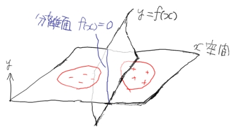
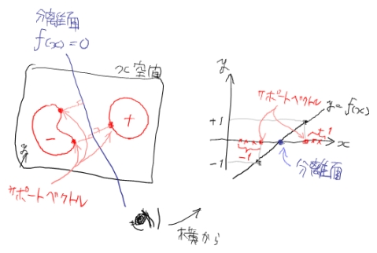

# SVM

## 問題定義

$$l$$ 個の入力ベクトル $$ x_i \ (i=1,\ldots,l) $$ と、各 $$ x_i $$ が属するクラス $$ y_i \in \{-1,+1\} $$ が学習データセットとして与えられたときに、これを正しくクラス分類する超曲面 $$ f(x)=0 $$ を求めることを考えます。

もう少し具体的に書くと、

$$ y_i f(x_i) > 0 $$

となる $$ f $$ を求めることと同値です。
また実際は、 $$ f $$ はいくつかの変数でパラメタライズしてあって、結局はそのパラメータをどうにかして決める問題になります。

## ハードマージンSVM

### 不等式制約つき凸関数最小化問題への帰着

$$ y_i=+1 $$ のデータ群と $$ y_i=-1 $$ のデータ群がきれいに分割されていて、超平面

$$ f(x)=wx+b=0 $$

で間違いなく分離できると仮定します。（ $$ w $$ は重みベクトルパラメータ、 $$ b $$ はバイアスパラメータ）。

無数の超平面が考えられますが、SVMでは、超平面に一番近いデータ点（ $$ x^* $$ と置く）との距離が最大となるようにします。
これは、直感的には、2つのデータ群のど真ん中で分離するというイメージです。

$$ x^* $$ と $$ wx+b=0 $$ との距離は $$ d^* = {|wx^*+b| \over |w|} $$ で計算できるので、目的の超平面はこの $$ d^* $$ を最大化することで求まります。
これで超平面そのものは一意に定まりますが、パラメータ $$ w,b $$ にはまだ自由度があります。
というのも、任意の $$ k>0 $$ について $$ kw,kb $$で決まる超平面はすべて $$ w,b $$ で決まる超平面と同じになるからです。

そこで、もうひとつの制約として $$ \mid wx^*+b \mid =1 $$ を導入します。
こうすると、 $$ \mid wx^*+b \mid = \mid f(x^*) \mid \le \mid f(x_i) \mid $$ なので、これは問題定義における不等式を

$$ y_i f(x_i) \ge 1 $$

に置き換えることと等価です。
一方、最大化の対象は $$ d^* = {|wx^*+b| \over |w|} = {1 \over |w|} $$ となりますが、後述するラグランジュの未定乗数法（の不等式制約ありバージョン）の計算における便宜上、

$$ \text{ minimize } \frac 12 w \cdot w = \frac 12 w^2 $$

という等価な表現に置き換えておきます。

まとめると、

$$
w,b \text{ s.t. }
\begin{array}{ll}
\text{ minimize }
& \frac 12 w^2 \\
\text{ subject to }
& y_i f(x_i) = y_i(wx_i+b) \ge 1 \ (i=1,\ldots,l)
\end{array}
$$

を見つける問題になります。これを主問題と呼んでおきましょう。

### 双対問題

さて双対定理によると、上記のような、凸関数からなる不等式制約つき最小化問題の最適値については、以下の双対問題の最適値と同じになるようです（自信なし、ちょっと調査不足・・・）。

$$
\max_{\alpha} \{ \min_{w,b} \{ L \} \ | \ \alpha_i \ge 0 \ (i=1,\ldots,l) \}
$$

$$ L $$ は主問題の一般ラグラジアンで、

$$
L = \frac 12 w^2 + \sum_i \alpha_i (1 - y_i(wx_i+b))
$$

となります。
$$ \alpha $$ はラグランジュ乗数です。

$$ \min_{w,b} \{ L \} $$ における $$ w,b $$ には制約がないので、
$$ { \partial L \over \partial w } =0, \  { \partial L \over \partial b } =0 $$ として極値をとります。
$$L(w,b)$$ は凸なので極値は最小値ですから。
すると

$$
w = \sum_i \alpha_i y_i x_i, \ \sum_i \alpha_i y_i = 0
$$

したがって

$$
\min_{w,b} \{ L \}
= L |_{ { \partial L \over \partial w } =0, \  { \partial L \over \partial b } =0 }
= \sum_i\alpha_i - \frac12\sum_{i,j}\alpha_i\alpha_jy_iy_jx_ix_j
$$

となります。
よって双対問題は

$$
\alpha \text{ s.t. }
\begin{array}{ll}
\text{ maximize }
& \sum_i\alpha_i - \frac12\sum_{i,j} \alpha_i\alpha_jy_iy_jx_ix_j \\
\text{ subject to }
& \sum_i \alpha_i y_i = 0, \alpha_i \ge 0 \, (i=1,\ldots,l)
\end{array}
$$

を見つける問題です。
この双対問題を解くこと＝ハードマージンSVMの学習です。

### サポートベクトル

$$\alpha$$ がどうにかして求まれば、 $$ w=\sum_i\alpha_iy_ix_i $$ なので、

$$
f(x)=\sum_i\alpha_iy_ix_ix+b
$$

となります。
バイアス $$b$$ は双対問題に表れていないので、主問題の制約 $$ |wx^*+b|=1 $$ を用いるしかありませんが、そもそもどの $$x_i$$ が $$x^*$$ か自明ではないように思えます。しかし実はKarush-Kuhn-Tucker条件（特に相補性条件）によると、

$$
\alpha_i(1-y_i(wx_i+b))=0
$$

なので、 $$\alpha_i > 0$$ を満たすいずれかのデータ $$i$$ で $$ b = y_i - wx_i $$ として求まります。
つまり $$\alpha_i > 0$$ に対応する $$x_i$$ が $$x^*$$ ということになります。

さて $$x^*$$ は分離超平面に一番近いデータ点でした。
当然ほとんどのデータ点は $$x^*$$ より遠いところにあるので、そのようなデータ $$o$$ では $$\alpha_o=0$$ となることがわかります。
一方で $$x^*$$ は一般に複数個存在します。最少でも $$-1$$ のクラスと $$+1$$ のクラスからそれぞれ1つずつ出てきます。
そこで $$x^*$$ の表記を改めて

$$ x_s \ (s \in \{ i \ | \ \alpha_i > 0\}) $$

とおくと、

$$
f(x)=\sum_s\alpha_sy_sx_sx+b
$$

なので、限られた数のデータ点 $$x_s$$ だけで分離超平面が構成されていることになります。
このデータ点 $$x_s$$ をサポートベクトルと呼びます。
分離超平面はサポートベクトルの重み付け和で表されていて、ラグランジュ乗数 $$\alpha$$ はその重みに対応しています。

### カーネルトリック

ここまで線形な分離面だけを考えてきましたが、 $$x$$ を非線形な写像 $$\phi$$ でより高次な特徴空間に持っていって $$\phi(x)$$ にしてから線形分離すれば、元の $$x$$ 空間では非線形な分離面を得ることができます。

これまでの定式化における $$x$$ を $$\phi(x)$$ に置き換えればいいわけですが、やってみると最終的には $$\phi(x_i)\phi(x_j)$$ という形しか必要になりません。
つまり高次特徴空間におけるベクトルの内積さえ計算できればいいわけです。
$$\phi(x_i)\phi(x_j)$$ を $$K(x_i,x_j)$$ と置き、カーネルと呼びます。

カーネルを適用すると、双対問題は

$$
\text{ find } \alpha \text{ s.t. }
\begin{array}{ll}
\text{ maximize }
& \sum_i\alpha_i - \frac12\sum_{i,j} \alpha_i\alpha_jy_iy_jK(x_i,x_j) \\
\text{ subject to }
& \sum_i \alpha_i y_i = 0, \alpha_i \ge 0 \, (i=1,\ldots,l)
\end{array}
$$

となり、分離超曲面は

$$
f(x)=\sum_i\alpha_iy_iK(x_i,x)+b=0
$$

となります。

カーネルさえ与えれば、陽に写像 $$\phi$$ を定義したり計算したりする必要はありません。
なので、可算無限次元の特徴空間（ $$\in$$ ヒルベルト空間）における分離でも、有限時間内で実行できることになります。
一方、カーネルは元は内積なので、どんな関数でもカーネルとして使っていいわけではなく、当然内積としての性質を持ったものでなくてはなりません。
いくつかの条件を満たす関数である必要があります。
例としては多項式カーネル $$(x_ix_j+c)^d$$ やガウシアンカーネル $$\exp\left(-{(x_i-x_j)^2\over\sigma^2}\right)$$ があります。

## SMOアルゴリズム

[SMOアルゴリズム](SMO) にて。

## ソフトマージンSVM

[ソフトマージンSVM](SoftMarginSVM) にて。

## SVMによる回帰

[SVMによる回帰](SVMRegression) にて。
