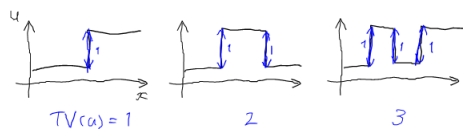
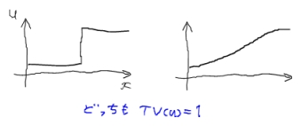
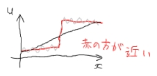

# Total Variation

## 定義

濃淡画像を、2次元座標 \(x=(x_1,x_2)\) を独立変数とする関数 \(u(x)\) のように表現します。
\(x\) は縦ベクトルで \(u\) はスカラです。
以降も、ベクトルを太字にしたり、関数の独立変数を全て明示したり、はしませんが、型推論すれば読めるように書くはず。

画像 \(u(x)\) のTotal Variationは以下のように定義されます：
\[ \int|\nabla u|dx \]
言葉で表現しようとすれば、画像の全ての点において、近傍との輝度の変化分の絶対値をとり、それを集めたものと考えることができます。

## 滑らかさの基準

簡単のため1次元の例で考えてみましょう。

このように、ギザギザした形のほうが高いTotal Variation値になることが直感的に分かります。
したがって、Total Variationは画像の滑らかさの示すものとして用いることができます。

というわけで、ある画像 \(u_0\) が与えられたとして、最小化問題
\[
\min_u \left(
  \int|\nabla u|dx + \frac1{2\lambda}\int(u-u_0)^2dx
\right)
\]
の解 \(u\) を考えます。
すると、最初の項によりなるべくTotal Variation的に滑らかな画像、一方で第2項によりなるべく \(u_0\) に近い画像になるはずです。
パラメータ \(\lambda\) は相反する両項の最小化のトレードオフを決め、\(\lambda\) が小さいほど元の画像 \(u_0\) を尊重するようになります。

さて今「Total Variation的に滑らか」といいましたが、これはどういう意味でしょう？
別の1次元の例を考えてみます。

つまり変化分が同じであれば、徐々に変化しても急に変化しても、同じTotal Variation値をとります。これにより、次の図のように、

灰色線で示したギザギザな画像に対して上の最小化問題を考えると、黒線よりも赤線のほうが好まれるという結果になります。
一般的な線形の空間フィルタを使うと、小さなギザギザだけでなく真ん中の大きな輝度変化もなまらせてしまいますが、Total Variation最小化ではエッジを保存して平滑化することができます。

## 最小化問題の解法

[TV最小化アルゴリズム](TV/TVMin) にて、上記最小化問題を解くアルゴリズムの導出を説明します。

## 応用

以下のように、画像の非線形フィルタとして用いることができます。

* [TV最小化ノイズ除去](TV/TVMinNR)
* TV最小化画像拡大
* TV最小化ブレ補正
