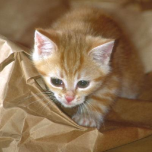
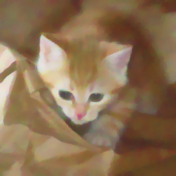

# TV最小化ノイズ除去

## 概要

ガウシアンノイズが加法的にのっている画像に対し、エッジを保存したノイズリダクションをかけます。

詳しい説明はまたいつか・・・。

## サンプルコード

とりあえず [ここ](https://github.com/convexbrain/studynotes/tree/master/sandbox/TVmin/denoising) にあるけど色々完成度低っ。

## 実行例

↓ オリジナル画像とノイズ入り画像

 

↓ ノイズ除去結果（処理強度：低→中→高）

  

画像は [ここ](http://www.freefoto.com/index.jsp) から入手。
