<!-- $size: A4 -->
<!-- page_number: true -->
<!-- footer: ブートストラップ情報量基準 -->

ブートストラップ情報量基準
=
情報量基準をモンテカルロ法で数値計算
* 長所
  * 真の分布についての解析的な前提条件が不要
  * パラメータ推定も数値計算で求解できればよい
  * 自由パラメータ数(AIC)が自明でない場合でも計算できる
* 短所
  * モンテカルロ近似誤差が生じる
  * モンテカルロ反復のため計算時間がかかる

---
復習
=
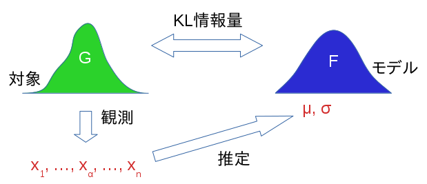

---
復習
=
***KL情報量*** （小さいほど、モデル$f$が真の分布$g$に近い）
  $$ I(g;f) = E_G\left[ \log{g(x)\over f(x)} \right]
            = \int \log{g(x)\over f(x)} dG $$
* $dG$：$g$で決まる確率分布を細切れにしたもの$(\int dG=1)$
* 連続モデルの場合
  * $g,f$：確率密度関数
  * $G$：$g$の累積分布関数
    * $G(x)=\int_{-\infty}^x g(z)dz$ つまり $dG/dx=g(x)$
  $$\rightarrow I(g;f) = \int_{-\infty}^\infty \left( \log{g(x)\over f(x)} \right) g(x)dx$$

---
復習
=
変形していくと
$$ \begin{aligned} I(g;f)
   &= \int \log{g(x)\over f(x)} dG \\
   &= \int \log g(x)dG - \int \log f(x)dG \\
   &= \mathrm{const.} - \int \log f(x)dG
   \end{aligned} $$
* 第1項：平均情報量（エントロピー）
  * 真の分布$G$のみに依存する定数
* 第2項：***平均対数尤度***

---
復習
=
ところで
* $f$：パラメータ$\theta$をもつパラメトリックモデル
* いま、$\theta$は、$G$から取得したデータ$\mathbf{x}_n=(x_1, \ldots, x_n)$にもとづいて、
  最尤推定などで求まる具体的な値$\hat\theta$であるとする
  $$ \mathrm{const.} - \int \log f(x|\hat\theta)dG $$
→$f,\hat \theta$のあてはまりの良さ
* この式（の第2項）を評価したいが、真の分布$G$は未知

---
復習
=
そこで、$G$→データにもとづく経験分布$\hat G$に置き換え
* $\hat G$：データ$x_1, \ldots, x_n$が等確率$1/n$で発生
$$ \mathrm{const.} - \int \log f(x|\hat\theta)d\hat G
   = \mathrm{const.} - {1\over n} \sum_{\alpha=1}^n \log f(x_\alpha|\hat\theta) $$
* 第2項：データにもとづく ***対数尤度*** の$1/n$
* 平均対数尤度→対数尤度に置き換え、とも言える

対数尤度に置き換えの結果、KL情報量に対して誤差が生じる
* 誤差（バイアス）を評価し、補正したい

---
復習
=
* バイアス＝置き換え前のKL情報量 − 置き換え後の式
  $$ \left( \mathrm{const.} - \int \log f(x|\hat\theta)dG \right) -
     \left( \mathrm{const.} - {1\over n} \sum_{\alpha=1}^n \log f(x_\alpha|\hat\theta) \right) $$
  $$ = {1\over n} \left[
     \sum_{\alpha=1}^n \log f(x_\alpha|\hat\theta) - n\int \log f(x|\hat\theta)dG
     \right] $$
* 期待値による評価
  * データ$\mathbf{x}_n=(x_1, \ldots, x_n)$を、確率変数$\mathbf{X}_n=(X_1, \ldots, X_n)$の実現値と考えて、確率分布$G$に対して平均をとる
    * ※$\hat\theta$も$\mathbf{x}_n$にもとづいて求まる値→平均にわたって変化

---
復習
=
バイアスの期待値評価
$$ {1\over n} E_{G(\mathbf{X}_n)} \left[
   \sum_{\alpha=1}^n \log f(X_\alpha|\hat\theta(\mathbf{X}_n))
   - n\int \log f(x|\hat\theta(\mathbf{X}_n))dG
   \right] $$
$$ = {1\over n} E_{G(\mathbf{X}_n)} \left[
   \log f(\mathbf{X}_n|\hat\theta(\mathbf{X}_n))
   - n\int \log f(x|\hat\theta(\mathbf{X}_n))dG
   \right] $$
$$ \equiv {1\over n} b(G)$$
* 真の分布$G$は未知

以降、$b(G)$を単に ***バイアス*** と呼ぶ

---
復習
=
KL情報量に戻って
* 対数尤度で置き換えたKL情報量に${1\over n} b(G)$を足して補正したもの
$$ \mathrm{const.} - {1\over n} \sum_{\alpha=1}^n \log f(x_\alpha|\hat\theta) + {1\over n} b(G)$$
$$ = \mathrm{const.} + {1\over 2n} \left(
   -2 \sum_{\alpha=1}^n \log f(x_\alpha|\hat\theta) + 2b(G) \right)$$
* 第2項大カッコ内：***情報量基準の一般形***
  * 真の分布$G$は未知
    * 様々な手法で$b(G)$を評価→様々な情報量基準

---
情報量基準の一般形
=
* 分布$G$から得たデータ$x_1, \ldots, x_n$でモデル$f$のパラメータ$\hat\theta$を推定
* $G$に対する$f, \hat\theta$ のあてはまりの良さを下式で評価
  $$ -2 \sum_{\alpha=1}^n \log f(x_\alpha|\hat\theta) + 2b(G) $$
  * ここでバイアス $b(G)=$
  $$ E_{G(\mathbf{X}_n)} \left[
     \log f(\mathbf{X}_n|\hat\theta(\mathbf{X}_n))
     - n\int \log f(x|\hat\theta(\mathbf{X}_n))dG
     \right] $$
  * ただし真の分布$G$は未知
    * 様々な手法で$b(G)$を評価→様々な情報量基準

---
ブートストラップ情報量基準
=
$b(G)$をブートストラップ法によるモンテカルロシミュレーションで評価
* ブートストラップ法
  1. 未知の$G$→データ$\mathbf{x}_n$にもとづく経験分布$\hat G$ で置き換え
     * $\hat G$：データ$x_1, \ldots, x_n$が等確率$1/n$で発生
  1. $\hat G$からの無作為標本による ***ブートストラップ標本*** を定義
     * 確率変数$\mathbf{X}_n^*=(X_1^*, \ldots, X_n^*)$
  1. ブートストラップ標本データを$B$回反復抽出
     * $\{\mathbf{x}_n^{*(i)}=(x_1^{*(i)}, \ldots, x_n^{*(i)}); i=1, \ldots, B\}$
     * ***ブートストラップ推定値*** （ここでは$b(\hat G)$）の算出
       * 特に$E_{\hat G(\mathbf{X}_n)}$：$B$本の$\mathbf{x}_n^{*(i)}$による平均

---
ブートストラップ情報量基準
=
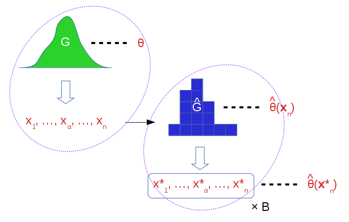

---
ブートストラップ情報量基準
=
バイアス
$$ b(G) = E_{G(\mathbf{X}_n)} \left[
   \log f(\mathbf{X}_n|\hat\theta(\mathbf{X}_n))
   - n\int \log f(x|\hat\theta(\mathbf{X}_n))dG
   \right] $$
* $G \rightarrow \hat G,\quad \mathbf{X}_n \rightarrow \mathbf{X}_n^*$

バイアスのブートストラップ推定値
$$ b^*(\hat G) = E_{\hat G(\mathbf{X}_n^*)} \left[
   \log f(\mathbf{X}_n^*|\hat\theta(\mathbf{X}_n^*))
   - n\int \log f(x|\hat\theta(\mathbf{X}_n^*))d\hat G
   \right] $$
* ※未知変数がなくなった

---
ブートストラップ情報量基準
=
$E_{\hat G(\mathbf{X}_n^*)}$内第1項の対数尤度
$$ \begin{aligned} \log f(\mathbf{X}_n^*|\hat\theta(\mathbf{X}_n^*))
   &= \log f(X_1^*, \ldots, X_n^*|\hat\theta(\mathbf{X}_n^*)) \\
   &= \log \prod_{\alpha=1}^n f(X_\alpha^*|\hat\theta(\mathbf{X}_n^*)) \\
   &= \sum_{\alpha=1}^n \log f(X_\alpha^*|\hat\theta(\mathbf{X}_n^*)) \\
   &\equiv \ell(\mathbf{X}_n^*|\hat\theta(\mathbf{X}_n^*))
   \end{aligned} $$

---
ブートストラップ情報量基準
=
$E_{\hat G(\mathbf{X}_n^*)}$内第2項の平均対数尤度の$n$倍
$$ \begin{aligned} n\int \log f(x|\hat\theta(\mathbf{X}_n^*))d\hat G
   &= n\cdot {1\over n} \sum_{\alpha=1}^n \log f(x_\alpha|\hat\theta(\mathbf{X}_n^*)) \\
   &= \sum_{\alpha=1}^n \log f(x_\alpha|\hat\theta(\mathbf{X}_n^*)) \\
   &\equiv \ell(\mathbf{x}_n|\hat\theta(\mathbf{X}_n^*))
   \end{aligned} $$
よって
$$ b^*(\hat G) = E_{\hat G(\mathbf{X}_n^*)} \left[
   \ell(\mathbf{X}_n^*|\hat\theta(\mathbf{X}_n^*))
   - \ell(\mathbf{x}_n|\hat\theta(\mathbf{X}_n^*))
   \right] $$

---
ブートストラップ情報量基準
=
$E_{\hat G(\mathbf{X}_n^*)}$：$B$本の$\mathbf{x}_n^{*(i)}$による平均 で近似
$$ \begin{aligned} b^*(\hat G)
   &\approx {1\over B}\sum_{i=1}^B \left[
            \ell(\mathbf{x}_n^{*(i)}|\hat\theta(\mathbf{x}_n^{*(i)}))
            - \ell(\mathbf{x}_n|\hat\theta(\mathbf{x}_n^{*(i)})) \right] \\
   &\equiv {1\over B}\sum_{i=1}^B D^{*(i)} \equiv b_B(\hat G)
   \end{aligned} $$

***ブートストラップ情報量基準EIC***
$$ 2\left( -\ell(\mathbf{x}_n|\hat\theta(\mathbf{x}_n)) + b_B(\hat G) \right) $$

---
例1：ブートストラップ近似誤差
=
* 真の分布$G$：標準正規分布$N(0, 1)$
* モデル$f$：正規分布$N(\mu, \sigma^2)$
  * 最尤法にてパラメータ推定
* ブートストラップシミュレーション
  * $B=100$
  * $n=25, 100, 400, 1600$
    * 各$n$ごとに試行回数 $T=10000$
      * $b_B(G)$の、試行平均／分散
      * $D^{*(i)}$の分散の、試行平均
        * ※$D^{*(i)}$の平均が$b_B(G)$
      * 対数尤度$\ell(\mathbf{x}_n|\hat\theta(\mathbf{x}_n))$の、試行平均

---
例1：ブートストラップ近似誤差
=
``` eic_ex1.py ```
 
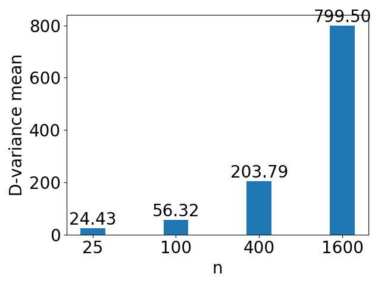 

---
例1：ブートストラップ近似誤差
=
* 真のバイアス値は2.27, 2.06, 2.02, 2.00
  * $n$が大→AICのバイアス推定値（自由パラメータ数）に近づく
* 分散：$n$とともに増大
  * $n$が大→ひとつひとつの試行のバイアス推定値は精度が悪い
* 2種類の分散が同じ傾向で増加している
  * ブートストラップ標本に対する$D^{*(i)}$の分散が原因

---
分散減少法
=
$D^{*(i)}$の分散を減らすテクニック
* $b(G) = E_{G(\mathbf{X}_n)} \left[ D(\mathbf{X}_n;G) \right]$ とおく
  $$ D(\mathbf{X}_n;G) \equiv \log f(\mathbf{X}_n|\hat\theta(\mathbf{X}_n))
                           - n\int \log f(x|\hat\theta(\mathbf{X}_n))dG $$
* $D=D_1+D_2+D_3$ と分解
  * $D_1 = \log f(\mathbf{X}_n|\hat\theta(\mathbf{X}_n)) - \log f(\mathbf{X}_n|\theta)$
  * $D_2 = \log f(\mathbf{X}_n|\theta) - n\int \log f(x|\theta)dG$
  * $D_3 = n\int \log f(x|\theta)dG - n\int \log f(x|\hat\theta(\mathbf{X}_n))dG$

  ※$\theta$は真の分布$G$について最尤のパラメータ

---
分散減少法
=
ここで $E_{G(\mathbf{X}_n)} \left[ D_2(\mathbf{X}_n;G) \right]$
$$ = E_{G(\mathbf{X}_n)} \left[ \log f(\mathbf{X}_n|\theta) \right] 
   -n E_{G(\mathbf{X}_n)} \left[ \int \log f(x|\theta)dG \right] $$
$$ = E_{G(\mathbf{X}_n)} \left[ \sum_{\alpha=1}^n \log f(X_\alpha|\theta) \right] 
   -n \int \log f(x|\theta)dG $$
$$ = \sum_{\alpha=1}^n E_{G(X_\alpha)} \left[ \log f(X_\alpha|\theta) \right] 
   -n \int \log f(x|\theta)dG $$
$$ = n E_{G(x)} \left[ \log f(x|\theta) \right] 
   -n \int \log f(x|\theta)dG = 0$$

---
分散減少法
=
したがって $b(G) = E_{G(\mathbf{X}_n)} \left[ D_1(\mathbf{X}_n;G) + D_3(\mathbf{X}_n;G) \right]$ より
$$ b_B(\hat G) = {1\over B}\sum_{i=1}^B \left[ D_1^{*(i)} + D_3^{*(i)} \right] $$
* $D_1^{*(i)} =
            \ell(\mathbf{x}_n^{*(i)}|\hat\theta(\mathbf{x}_n^{*(i)}))
            - \ell(\mathbf{x}_n^{*(i)}|\hat\theta(\mathbf{x}_n))$
* $D_3^{*(i)} =
            \ell(\mathbf{x}_n|\hat\theta(\mathbf{x}_n))
            - \ell(\mathbf{x}_n|\hat\theta(\mathbf{x}_n^{*(i)}))$
  * ※$D_1,D_3$内の$\theta$は、$\hat G$について最尤（つまりデータ$\mathbf{x}_n$について最尤）のパラメータ$\hat\theta(\mathbf{x}_n)$に置き換わっている
* 以下が示されている→ブートストラップ標本に対する分散を減少
  * $D_1,D_3$の分散：$O(1)$
  * $D_2$の分散：$O(n)$

---
例2-1：例1と同じ条件で分散減少法を使用
=
``` eic_ex2-2.py ```
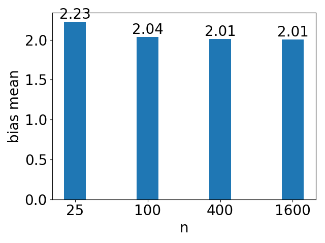 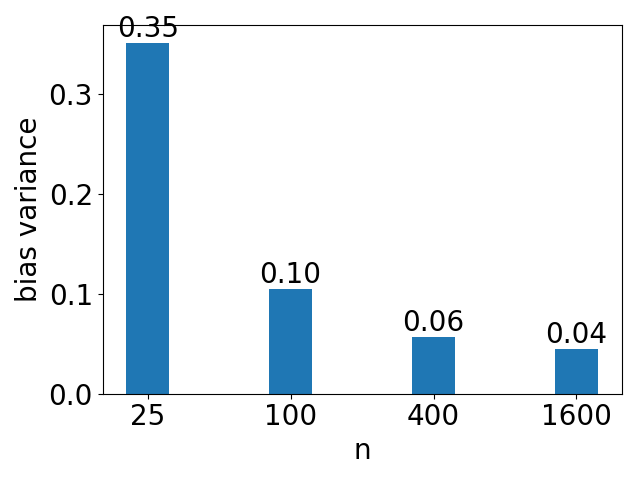
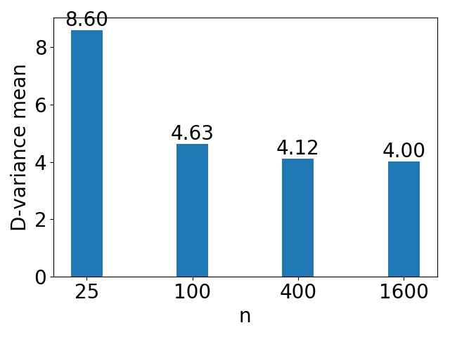

---
例2-2：例1と同じ条件で分散減少法を使用、真の分布がラプラス分布の場合
=
``` eic_ex2-2.py ```
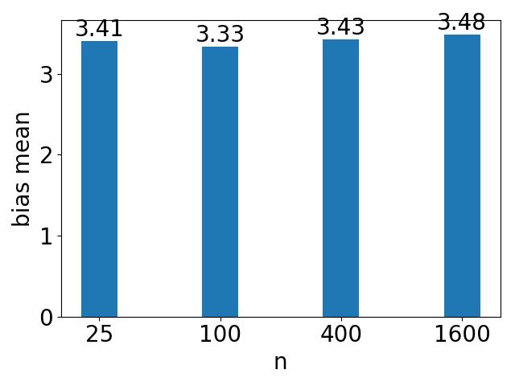 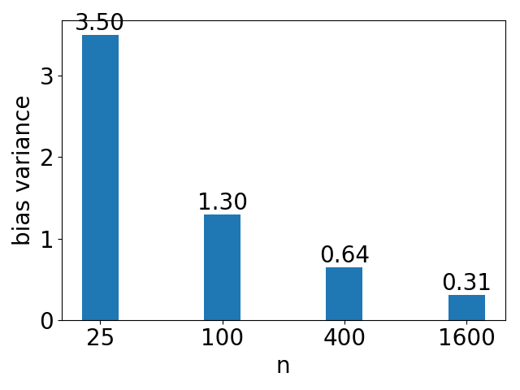

* 真のバイアス値は3.87, 3.57, 3.56, ?(n=1600)
  * AICのバイアス推定値2より近い値になっている

---
例2-3：例1と同じ条件で分散減少法を使用、パラメータ推定がメジアン推定量の場合
=
メジアン推定量
* $\mu\rightarrow\hat\mu_m=\mathrm{median}_i\{X_i\}$
* $\sigma\rightarrow\hat\sigma_m=c^{-1}\mathrm{median}_i\{|X_i-\hat\mu_m|\}$
  * $c=\Phi^{-1}(0.75)$
    * $\Phi$：$N(0, 1)$の累積分布関数

---
例2-3：例1と同じ条件で分散減少法を使用、パラメータ推定がメジアン推定量の場合
=
``` eic_ex2-2.py ```
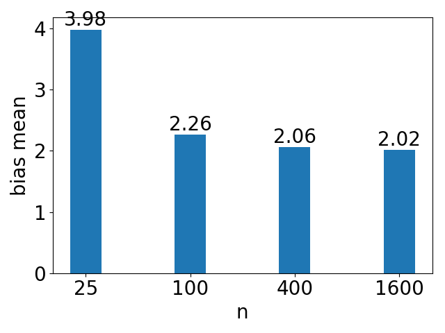 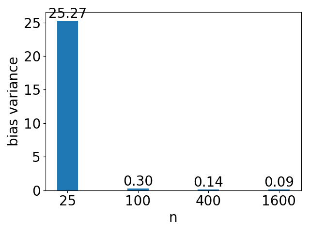

* 真のバイアス値は2.58, 2.12, 2.02, ?(n=1600)

---
EIC適用例：変化点モデル
=
* $n$個のデータ$x_1, \ldots, x_n$
* 区間$1, \ldots, n$を$k$個に分割
  * $[1, n_1], [n_1+1, n_2], \cdots, [n_{k-1}+1, n]$
* 各区間$j=1, \ldots, k$について
  * $x_\alpha \sim N(\mu_j, \sigma^2_j), \quad \alpha=n_{j-1}+1, \ldots, n_j$
  * ただし$n_0=0, n_k=n$
* $\mu_j, \sigma^2_j$に加えて、分割数$k$、分割点$n_j$も未知とする
  * AICの場合、パラメータ数をどうカウントすべきか自明でない

---
EIC適用例：変化点モデル
=
ブートストラップ法を以下のように適用
* 区間数$k=1,\ldots,K$について
  1. 分割点$n_1,\ldots,n_{k-1}$、正規分布パラメータ$\mu_j, \sigma^2_j$の最尤推定
  1. 残差$\hat\varepsilon_\alpha=x_\alpha-\mu_j$を計算
  1. 残差を$n$個リサンプリングして$\hat\varepsilon^*_\alpha$を生成し、ブートストラップサンプル$x^*_\alpha=\mu_j+\hat\varepsilon^*_\alpha$を生成
  1. $n^*_1,\ldots,n^*_{k-1}, \mu^*_j, \sigma^{2*}_j$を最尤推定
  1. iii., iv.を$B$回繰り返して、バイアスのブートストラップ推定値を求める
* ※分割点の最尤推定は${}_{n-1}C_{k-1}$の総当たり

---
例3：変化点モデル
=
* ブートストラップシミュレーション
  * $n=100$
    * 真の分割数$k=2$、真の分割点$n_1=50$
    * 第1の区間：$N(0, 1)$、第2の区間：$N(c, 1)$
  * $c=0, 0.5, 1, 2, 4, 8$の6通り
  * $k=1, 2, 3$の3通りのモデル
    * $B=100$（テキストでは不明）
    * 試行回数$T=10$（テキストでは不明）

---
例3：変化点モデル
=
``` eic_ex3.py ```
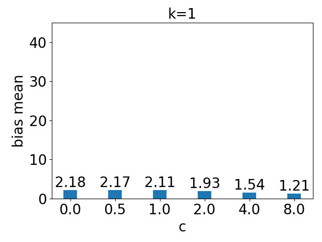 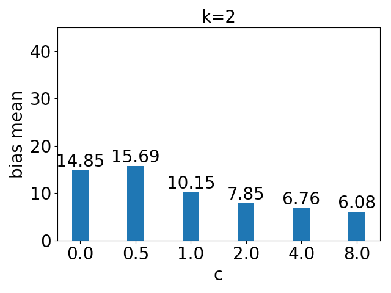 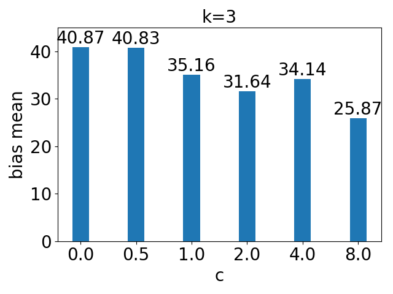
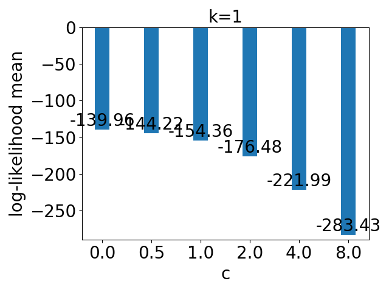 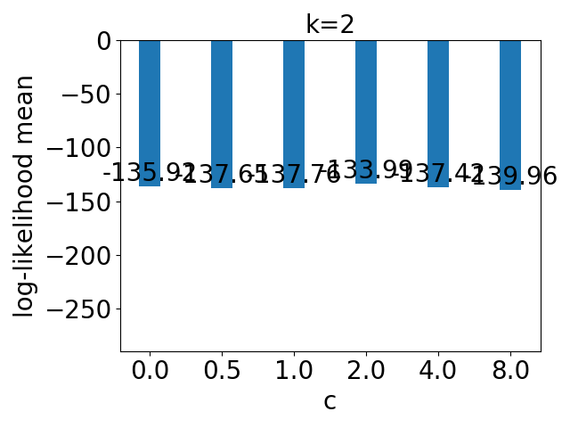 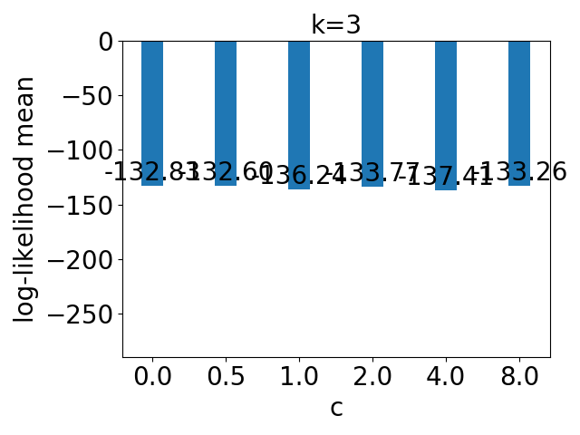

---
例3：変化点モデル
=
* 例えば$c=1$のときの情報量基準
  * EIC：順に$156.47, 147.91, 171.40$（の2倍）で、真の$k=2$で最小
  * AIC：仮に自由パラメータ数を$2, 4, 6$とすると順に$156.26, 141.76, 142.24$（の2倍）で、$k=2, 3$で差が少ない
* $c\rightarrow0$
  * 分割の推定が間違っていても、見かけのあてはまり（対数尤度）は良くなる
  * 一方で真の分布からは乖離するので、それに整合してバイアス推定値が大きくなる

  $k=2\rightarrow3$についても同様だが、バイアス推定値の増大が著しい

---
EIC適用例：部分回帰モデル
=
目的変数$Y$と$K$次元ベクトルの説明変数$X$
* $n$個のデータ$\{(y_\alpha, x_{\alpha1}, \ldots, x_{\alpha K}); \alpha=1, 2, \ldots, n\}$
* 回帰モデル
  $$ y_\alpha = \sum_{j=1}^K \beta_j x_{\alpha j} + \varepsilon_\alpha, \quad
     \varepsilon_\alpha \sim N(0, \sigma^2) $$
* ここで、変数選択（$K$個から$k$個選ぶ）を考える
  * ${}_K C_{k}$通り
  * ※変数選択のしかたによって当てはまりの良さが変わるが、AICのバイアス推定値（自由パラメータ数）に反映する方法が自明ではない

---
例4：部分回帰モデル
=
* $K=20, n=100$ でデータ生成
  * 真の$\beta_j=0$、真の$\sigma^2=1$（テキストでは不明）
    * つまり$y_\alpha \sim N(0, 1)$
  * $x_{\alpha j} \sim N(0, 1)$とする（テキストでは不明）
* $k=0,\ldots,K$ でブートストラップシミュレーション
  * 以下の変数選択で$\beta_j, \sigma^2$を最尤推定
    * EIC1：単に$x_{\alpha1},\ldots,x_{\alpha k}$を選択
    * EIC2：${}_K C_{k}$の総当たりで尤度最大
  * $B=100$
* 試行回数$T=10$（テキストでは$1000$だがEIC2で時間がかかりすぎるため）

---
例4：部分回帰モデルの最尤推定
=
$\beta=(\beta_1 \cdots \beta_k)^T, x_\alpha=(x_{\alpha1} \cdots x_{\alpha k})^T$ とおく

対数尤度
  $$\begin{aligned} \ell
    &= \sum_\alpha \log p(y_\alpha, x_\alpha; \beta, \sigma^2)  \\
    &= \sum_\alpha \log \left\{
       {1\over\sqrt{2\pi\sigma^2}} \exp\left(-{(y_\alpha - x_\alpha^T \beta)^2 \over 2 \sigma^2}\right)
       \right\}  \\
  &= \sum_\alpha \log {1\over\sqrt{2\pi\sigma^2}}
     - \sum_\alpha {(y_\alpha - x_\alpha^T \beta)^2 \over 2 \sigma^2}  \\
  &= -{n \over 2} \log 2\pi\sigma^2
     -{1 \over 2 \sigma^2} \sum_\alpha (y_\alpha - x_\alpha^T \beta)^2  \\
    \end{aligned}$$

---
例4：部分回帰モデルの最尤推定
=
$y=(y_1 \cdots y_n)^T,
 X = \left[ \begin{array}{ccc}
 x_1^T \\ \vdots \\ x_n^T
 \end{array} \right]$ とおく
$$\begin{aligned} \ell
  &= -{n \over 2} \log 2\pi\sigma^2
     -{1 \over 2 \sigma^2} \|y - X\beta\|^2
  \end{aligned}$$
${\partial\ell\over\partial\beta}=0$より${\partial\over\partial\beta}\|y - X\beta\|^2=0$
$${\partial\over\partial\beta}(y^2 -2y^T X\beta + \beta^T X^T X \beta)=0$$
$$-2(y^T X)^T + 2 X^T X \beta=0$$

---
例4：部分回帰モデルの最尤推定
=
よって$X^T X \beta=X^T y$を線形ソルバで解けばよい
* あるいは$\beta=(X^T X)^{-1}X^T y$（擬似逆行列）

${\partial\ell\over\partial\sigma}=0$より
$$ -{n \over 2} {2\sigma\over\sigma^2} +{1 \over \sigma^3} \|y - X\beta\|^2 = 0 $$
$$ -n \sigma^2 + \|y - X\beta\|^2 = 0 $$
よって$\sigma^2 = {1 \over n}\|y - X\beta\|^2$

---
例4：部分回帰モデル
=
``` eic_ex4-1.py ```
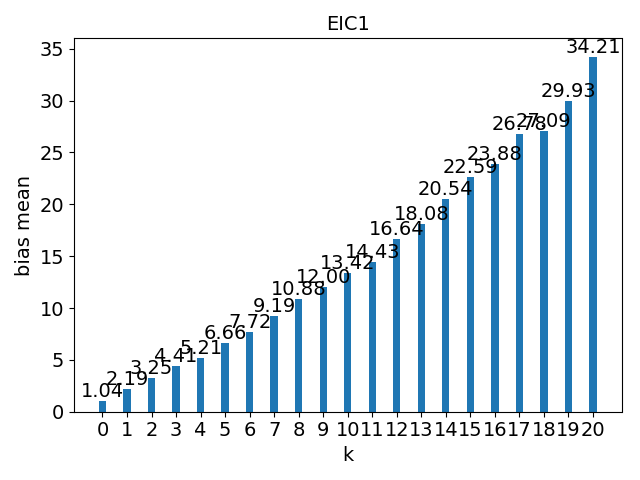 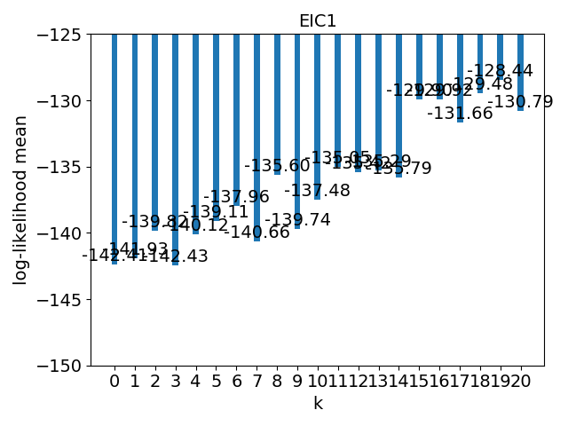

---
例4：部分回帰モデル
=
``` eic_ex4-2.py ```
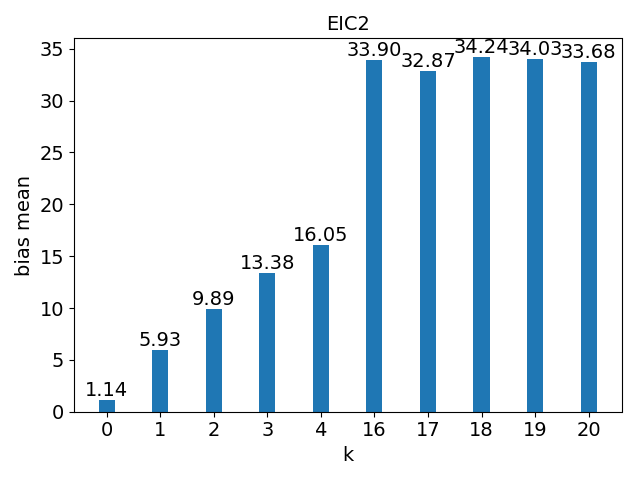 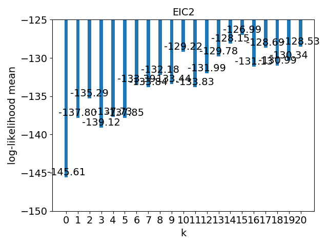

---
例4：部分回帰モデル
=
バイアス推定値
* $k=0, 20$の場合、EIC1とEIC2は一致すべき→近似誤差
* EIC1では、自由パラメータ数$k+1$（AICのバイアス推定値）から徐々に増加方向に離れていく
  * 固定のデータ数$n$に対して、パラメータ数だけが大きくなっており、$n\rightarrow\infty$の漸近的性質と逆
* 対してEIC2では、$k$が小さい時に一気に増加
  * 最尤変数選択により、見かけの当てはまりだけがよくなるため
  * 真の$\beta=0$からは乖離するので、それに整合してバイアス推定値が大きくなる

---
Excuse
=
* 例3、例4：結果がテキストの値と異なっていますが原因が追求しきれていません
* 例3：$k>1$だと$\sigma\approx0$となる特異的な状況が発生しやすいため、$\sigma<0.1$とならないようアドホックに回避しています
* p.138の2段階ブートストラップは導出できていません
  * いろいろ実験もしたが再現できず
